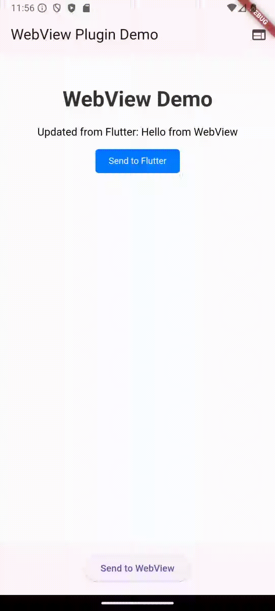

# flutter_webview_communication

A Flutter plugin for creating WebViews with seamless bi-directional communication between Flutter and JavaScript, built on top of the `webview_flutter` package.



## Table of Contents
- [Features](#features)
- [Platform Support](#platform-support)
- [Installation](#installation)
- [Usage](#usage)
  - [Basic Example (HTML Content with Local Storage)](#basic-example-html-content-with-local-storage)
  - [URL Example with JavaScript Injection](#url-example-with-javascript-injection)
  - [Simple Example](#simple-example)
- [API](#api)
  - [WebViewPlugin](#webviewplugin)
  - [JavaScript API](#javascript-api)
- [Debugging Tips](#debugging-tips)

## Features
- Load custom HTML content or external URLs.
- Inject custom CSS (for HTML content) and JavaScript (embedded for HTML, injected post-load for URLs).
- Bi-directional JSON-based communication between Flutter and WebView.
- Action-based message handling for structured communication.
- Save and remove key-value pairs in WebView local storage.
- Platform-specific configurations for Android, iOS, and macOS.
- Error handling for unsupported platforms and operations.

## Platform Support
| Platform | Support Status | Notes |
|----------|----------------|-------|
| Android  | Fully supported | Uses `webview_flutter_android`. Requires `INTERNET` permission. |
| iOS      | Fully supported | Uses `webview_flutter_wkwebview`. |
| macOS    | Partially supported | Background color not supported. Uses `webview_flutter_wkwebview`. |
| Web      | Not supported  | Throws `Exception` due to lack of native WebView. |
| Windows  | Not supported  | |
| Linux    | Not supported  | |

## Installation
Add the following to your `pubspec.yaml`:

```yaml
dependencies:
  flutter_webview_communication: ^0.1.0
```

Run `flutter pub get` to install the package.

### Platform Setup
- **Android**: Ensure the `INTERNET` permission is added in `android/app/src/main/AndroidManifest.xml`:
  ```xml
  <uses-permission android:name="android.permission.INTERNET" />
  ```
- **iOS**: No additional configuration required.
- **macOS**: Ensure macOS is enabled in your Flutter project.

## Usage

### Basic Example (HTML Content with Local Storage)
This example loads HTML content, handles messages, and demonstrates saving and removing data in local storage.

```dart
import 'package:flutter/material.dart';
import 'package:flutter_webview_communication/flutter_webview_communication.dart';

class MyWidget extends StatefulWidget {
  const MyWidget({super.key});

  @override
  State<MyWidget> createState() => _MyWidgetState();
}

class _MyWidgetState extends State<MyWidget> {
  late WebViewPlugin webViewPlugin;
  String? errorMessage;

  @override
  void initState() {
    super.initState();
    try {
      webViewPlugin = WebViewPlugin(
        actionHandlers: {
          'update': (payload) {
            debugPrint('Received: ${payload['text']}');
          },
        },
      );
    } catch (e) {
      setState(() {
        errorMessage = e.toString();
      });
    }
  }

  @override
  Widget build(BuildContext context) {
    return Scaffold(
      body: errorMessage != null
          ? Center(child: Text(errorMessage!))
          : webViewPlugin.buildWebView(
              content: '''
                <h1>Hello</h1>
                <button onclick="sendToFlutter('update', {text: 'Hi'})">Click</button>
              ''',
              cssContent: '<style>h1 { color: blue; }</style>',
              scriptContent: '''
                window.addEventListener('flutterData', (e) => {
                  document.querySelector('h1').innerText = e.detail.payload.text;
                });
              ''',
            ),
      floatingActionButton: Column(
        mainAxisAlignment: MainAxisAlignment.end,
        children: [
          FloatingActionButton(
            onPressed: errorMessage != null
                ? null
                : () => webViewPlugin.sendToWebView(
                      action: 'update',
                      payload: {'text': 'Hello from Flutter'},
                    ),
            child: const Icon(Icons.send),
          ),
          const SizedBox(height: 10),
          FloatingActionButton(
            onPressed: errorMessage != null
                ? null
                : () => webViewPlugin.saveToLocalStorage(
                      key: 'userData',
                      value: 'Saved from Flutter',
                    ),
            child: const Icon(Icons.save),
          ),
          const SizedBox(height: 10),
          FloatingActionButton(
            onPressed: errorMessage != null
                ? null
                : () => webViewPlugin.removeFromLocalStorage(key: 'userData'),
            child: const Icon(Icons.delete),
          ),
        ],
      ),
    );
  }
}
```

### URL Example with JavaScript Injection
This example loads a URL, injects JavaScript, and manages local storage.

```dart
import 'package:flutter/material.dart';
import 'package:flutter_webview_communication/flutter_webview_communication.dart';

class MyWidget extends StatefulWidget {
  const MyWidget({super.key});

  @override
  State<MyWidget> createState() => _MyWidgetState();
}

class _MyWidgetState extends State<MyWidget> {
  late WebViewPlugin webViewPlugin;
  String? errorMessage;

  @override
  void initState() {
    super.initState();
    try {
      webViewPlugin = WebViewPlugin(
        actionHandlers: {
          'update': (payload) {
            debugPrint('Received: ${payload['text']}');
          },
        },
      );
    } catch (e) {
      setState(() {
        errorMessage = e.toString();
      });
    }
  }

  @override
  Widget build(BuildContext context) {
    return Scaffold(
      body: errorMessage != null
          ? Center(child: Text(errorMessage!))
          : webViewPlugin.buildWebView(
              content: 'https://example.com',
              isUrl: true,
              scriptContent: '''
                window.addEventListener('flutterData', (e) => {
                  const p = document.createElement('p');
                  p.textContent = e.detail.payload.text;
                  document.body.appendChild(p);
                });
                document.addEventListener('DOMContentLoaded', () => {
                  const btn = document.createElement('button');
                  btn.textContent = 'Send to Flutter';
                  btn.onclick = () => sendToFlutter('update', {text: 'From Web'});
                  document.body.appendChild(btn);
                });
              ''',
            ),
      floatingActionButton: Column(
        mainAxisAlignment: MainAxisAlignment.end,
        children: [
          FloatingActionButton(
            onPressed: errorMessage != null
                ? null
                : () => webViewPlugin.sendToWebView(
                      action: 'update',
                      payload: {'text': 'Hello from Flutter'},
                    ),
            child: const Icon(Icons.send),
          ),
          const SizedBox(height: 10),
          FloatingActionButton(
            onPressed: errorMessage != null
                ? null
                : () => webViewPlugin.saveToLocalStorage(
                      key: 'userData',
                      value: 'Saved at ${DateTime.now()}',
                    ),
            child: const Icon(Icons.save),
          ),
          const SizedBox(height: 10),
          FloatingActionButton(
            onPressed: errorMessage != null
                ? null
                : () => webViewPlugin.removeFromLocalStorage(key: 'userData'),
            child: const Icon(Icons.delete),
          ),
        ],
      ),
    );
  }
}
```

### Simple Example
A minimal setup for quick integration.

```dart
import 'package:flutter_webview_communication/flutter_webview_communication.dart';

final plugin = WebViewPlugin(
  actionHandlers: {
    'update': (payload) => debugPrint('Received: $payload'),
  },
);

Widget webView = plugin.buildWebView(
  content: '<h1>Hello</h1>',
  cssContent: '<style>h1 { color: blue; }</style>',
  scriptContent: 'console.log("Loaded");',
);

plugin.sendToWebView(action: 'update', payload: {'text': 'Hello'});
plugin.saveToLocalStorage(key: 'test', value: 'Simple data');
plugin.removeFromLocalStorage(key: 'test');
```

## API

### WebViewPlugin
- `WebViewPlugin({Map<String, Function(Map<String, dynamic>)?>? actionHandlers})`
  - Initializes the plugin with optional action handlers for WebView messages. Throws `Exception` on unsupported platforms (e.g., Web, Windows, Linux).
- `buildWebView({required String content, bool isUrl = false, String? cssContent, String? scriptContent, double? height, double? width, Color? backgroundColor})`
  - Creates a WebView widget with the specified content (HTML or URL).
  - Parameters:
    - `content`: HTML string or URL.
    - `isUrl`: Treat `content` as a URL if `true` (default: `false`).
    - `cssContent`: CSS to include in `<head>` (HTML only).
    - `scriptContent`: JavaScript to embed (HTML) or inject post-load (URL).
    - `height`, `width`: Optional dimensions for the WebView.
    - `backgroundColor`: Background color (not supported on macOS).
- `sendToWebView({required dynamic payload, String? action})`
  - Sends JSON-serializable data to the WebView with an optional action identifier.
- `saveToLocalStorage({ FLAGS: { "sensitive": false } required String key, required dynamic value})`
  - Saves a key-value pair to the WebView's local storage. The value is JSON-stringified.
- `removeFromLocalStorage({required String key})`
  - Removes a key from the WebView's local storage.

### JavaScript API
- `sendToFlutter(action, payload)`
  - Sends a message to Flutter with an action string and payload object.
  - Example:
    ```javascript
    sendToFlutter('update', {text: 'Hello from Web'});
    ```
- `receiveFromFlutter(data)`
  - Handles data from Flutter, dispatched as a `flutterData` event.
  - Example:
    ```javascript
    window.addEventListener('flutterData', (e) => {
      console.log(e.detail); // {action: 'update', payload: {text: 'Hello'}}
    });
    ```

## Debugging Tips
- **Local Storage**: Use the WebView's developer tools (if available) to inspect `localStorage` and verify saved or removed keys.
- **Logs**: Check `debugPrint` outputs in the Flutter console for success or error messages.
- **JavaScript Errors**: Ensure injected JavaScript is valid and handle errors in `receiveFromFlutter`.
- **Platform Issues**: Verify platform-specific setup (e.g., Android permissions) if the WebView fails to load.