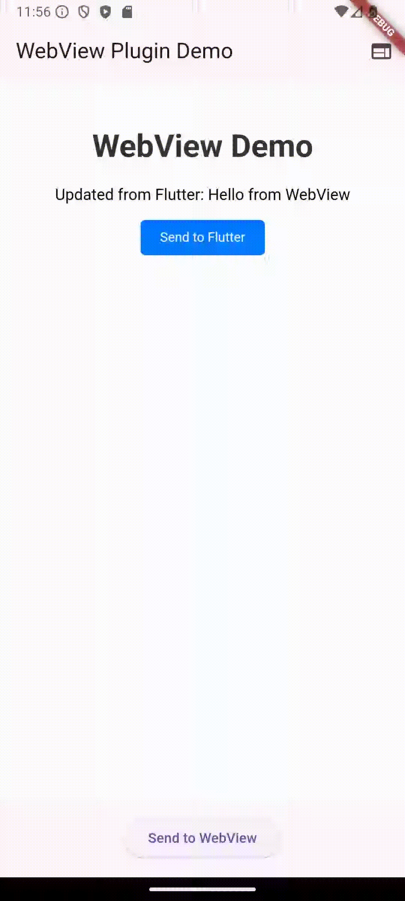

# flutter_webview_communication

A Flutter plugin for creating WebViews with seamless bi-directional communication between Flutter and JavaScript, built on top of the `webview_flutter` package (version 4.8.0).



## Table of Contents

- [flutter_webview_communication](#flutter_webview_communication)
  - [Table of Contents](#table-of-contents)
  - [Features](#features)
  - [Platform Support](#platform-support)
  - [Installation](#installation)
    - [Platform Setup](#platform-setup)
  - [Usage](#usage)
    - [Basic Example (HTML Content with Local Storage)](#basic-example-html-content-with-local-storage)
    - [URL Example with JavaScript Injection](#url-example-with-javascript-injection)
    - [Simple Example](#simple-example)
  - [API](#api)
    - [WebViewPlugin](#webviewplugin)
    - [Navigation Controls](#navigation-controls)
    - [Zoom Controls](#zoom-controls)
    - [Cookie Management](#cookie-management)
    - [Scroll Controls](#scroll-controls)
    - [Find in Page](#find-in-page)
    - [File Handling](#file-handling)
    - [JavaScript Channel Management](#javascript-channel-management)
    - [Console Message Capture](#console-message-capture)
    - [Page Metadata \& Information](#page-metadata--information)
    - [Element Interaction](#element-interaction)
    - [Security \& URL Filtering](#security--url-filtering)
    - [Performance Monitoring](#performance-monitoring)
    - [Network Monitoring](#network-monitoring)
    - [JavaScript API](#javascript-api)
  - [Platform-Specific Features](#platform-specific-features)
  - [Debugging Tips](#debugging-tips)
  - [Contributing](#contributing)

## Features

- Load custom HTML content or external URLs.
- Inject custom CSS (for HTML content) and JavaScript (embedded for HTML, injected post-load for URLs).
- Bi-directional JSON-based communication between Flutter and WebView with action-based message handling.
- Manage WebView local storage: save, retrieve, remove, and clear key-value pairs.
- Apply Content Security Policy (CSP) to custom HTML for enhanced security.
- Set custom user agent strings for WebView requests.
- Monitor loading states (started, progress, finished, error) with progress percentages and HTTP error details.
- Retrieve the current scroll position of the WebView using JavaScript.
- Clear cookies, cache, and local storage with a single method.
- Reload the current WebView content (HTML or URL).
- Comprehensive JavaScript error handling via a callback.
- **NEW: Navigation controls** - Back, forward, stop loading, get URL/title.
- **NEW: Zoom controls** - Zoom in/out, set zoom level, enable/disable zoom.
- **NEW: Enhanced cookie management** - Get/set individual cookies, check for cookies.
- **NEW: Advanced scroll controls** - Scroll to position, scroll by offset, smooth scrolling.
- **NEW: Find in page** - Search text, navigate matches, highlight results.
- **NEW: File handling** - Download files with progress, upload files, file picker integration.
- **NEW: Lifecycle management** - Proper disposal of resources.
- **NEW: JavaScript channel management** - Add/remove custom channels dynamically.
- **NEW: Console message capture** - Capture and monitor console logs.
- **NEW: Page metadata extraction** - Get page info, links, images, HTML, text.
- **NEW: Element interaction** - Click elements, set/get input values, inject CSS.
- **NEW: Security & URL filtering** - Whitelist/blacklist URLs, custom validators.
- **NEW: Performance monitoring** - Get page load metrics, memory usage, resource counts.
- **NEW: Network monitoring** - Monitor XHR and Fetch requests.
- **NEW: Permission handling** - Request and check geolocation, camera, microphone, storage permissions.
- Cross-platform support with minimal dependencies.

## Platform Support

| Platform | Support Status  | Notes                                                  |
| -------- | --------------- | ------------------------------------------------------ |
| Android  | Fully supported | Requires `minSdkVersion 19` and `INTERNET` permission. |
| iOS      | Fully supported | No additional configuration required.                  |
| macOS    | Fully supported | Background color uses CSS fallback.                    |
| Web      | Fully supported | Uses IFrameElement (built-in).                         |
| Windows  | Fully supported | Uses webview_windows package.                          |
| Linux    | Fully supported | Uses WebKitGTK.                                        |

## Installation

Add the following to your `pubspec.yaml`:

```yaml
dependencies:
  flutter_webview_communication: ^0.1.6
```

Run `flutter pub get` to install the package.

### Platform Setup

- **Android**: Ensure the minimum SDK version is set in `android/app/build.gradle`:
  ```yaml
  android {
  defaultConfig {
  minSdkVersion 19
  }
  }
  ```
  Add the `INTERNET` permission in `android/app/src/main/AndroidManifest.xml`:
  ```xml
  <uses-permission android:name="android.permission.INTERNET" />
  ```
- **iOS**: No additional configuration required.
- **macOS**: Ensure macOS is enabled in your Flutter project (e.g., via `flutter create --platforms=macos`).

## Usage

### Basic Example (HTML Content with Local Storage)

This example loads HTML content, handles messages, manages local storage, retrieves scroll position, and monitors loading states.

```dart
import 'package:flutter/material.dart';
import 'package:flutter_webview_communication/flutter_webview_communication.dart';

class MyWidget extends StatefulWidget {
  const MyWidget({super.key});

  @override
  State<MyWidget> createState() => _MyWidgetState();
}

class _MyWidgetState extends State<MyWidget> {
  late WebViewPlugin webViewPlugin;
  String? errorMessage;
  String loadingState = 'idle';
  int? loadingProgress;

  @override
  void initState() {
    super.initState();
    try {
      webViewPlugin = WebViewPlugin(
        enableCommunication: true,
        actionHandlers: {
          'update': (payload) {
            ScaffoldMessenger.of(context).showSnackBar(
              SnackBar(content: Text('Received: ${payload['text']}')),
            );
          },
        },
        onJavaScriptError: (error) {
          setState(() {
            errorMessage = error;
          });
        },
      );
    } catch (e) {
      setState(() {
        errorMessage = e.toString();
      });
    }
  }

  @override
  Widget build(BuildContext context) {
    return Scaffold(
      body: errorMessage != null
          ? Center(child: Text(errorMessage!))
          : Column(
              children: [
                Padding(
                  padding: const EdgeInsets.all(8.0),
                  child: Text('Loading: $loadingState${loadingProgress != null ? ' ($loadingProgress%)' : ''}'),
                ),
                Expanded(
                  child: webViewPlugin.buildWebView(
                    content: '''
                      <h1>Hello</h1>
                      <button onclick="sendToFlutter('update', {text: 'Hi'})">Click</button>
                    ''',
                    cssContent: '<style>h1 { color: blue; }</style>',
                    scriptContent: '''
                      window.addEventListener('flutterData', (e) => {
                        document.querySelector('h1').innerText = e.detail.payload.text;
                      });
                    ''',
                    csp: "default-src 'self'; script-src 'self' 'unsafe-inline'; style-src 'self' 'unsafe-inline'",
                    userAgent: 'MyApp/1.0',
                    onLoadingStateChanged: (state, progress, error) {
                      setState(() {
                        loadingState = state;
                        loadingProgress = progress;
                        if (error != null) {
                          errorMessage = error;
                        }
                      });
                    },
                  ),
                ),
              ],
            ),
      floatingActionButton: Column(
        mainAxisAlignment: MainAxisAlignment.end,
        children: [
          FloatingActionButton(
            onPressed: errorMessage != null
                ? null
                : () => webViewPlugin.sendToWebView(
                      action: 'update',
                      payload: {'text': 'Hello from Flutter'},
                    ),
            child: const Icon(Icons.send),
            tooltip: 'Send to WebView',
          ),
          const SizedBox(height: 10),
          FloatingActionButton(
            onPressed: errorMessage != null
                ? null
                : () => webViewPlugin.saveToLocalStorage(
                      key: 'userData',
                      value: 'Saved from Flutter',
                    ),
            child: const Icon(Icons.save),
            tooltip: 'Save to Local Storage',
          ),
          const SizedBox(height: 10),
          FloatingActionButton(
            onPressed: errorMessage != null
                ? null
                : () => webViewPlugin.removeFromLocalStorage(key: 'userData'),
            child: const Icon(Icons.delete),
            tooltip: 'Remove from Local Storage',
          ),
          const SizedBox(height: 10),
          FloatingActionButton(
            onPressed: errorMessage != null
                ? null
                : () async {
                    final storage = await webViewPlugin.getLocalStorage();
                    if (mounted) {
                      ScaffoldMessenger.of(context).showSnackBar(
                        SnackBar(content: Text('Storage: $storage')),
                      );
                    }
                  },
            child: const Icon(Icons.storage),
            tooltip: 'Get Local Storage',
          ),
          const SizedBox(height: 10),
          FloatingActionButton(
            onPressed: errorMessage != null
                ? null
                : () async {
                    final position = await webViewPlugin.getScrollPosition();
                    if (mounted) {
                      ScaffoldMessenger.of(context).showSnackBar(
                        SnackBar(content: Text('Scroll: x=${position['x']}, y=${position['y']}')),
                      );
                    }
                  },
            child: const Icon(Icons.arrow_downward),
            tooltip: 'Get Scroll Position',
          ),
          const SizedBox(height: 10),
          FloatingActionButton(
            onPressed: errorMessage != null
                ? null
                : () => webViewPlugin.clearWebViewData(),
            child: const Icon(Icons.clear),
            tooltip: 'Clear WebView Data',
          ),
          const SizedBox(height: 10),
          FloatingActionButton(
            onPressed: errorMessage != null
                ? null
                : () => webViewPlugin.reload(),
            child: const Icon(Icons.refresh),
            tooltip: 'Reload WebView',
          ),
        ],
      ),
    );
  }
}
```

### URL Example with JavaScript Injection

This example loads a URL and injects JavaScript.

```dart
import 'package:flutter/material.dart';
import 'package:flutter_webview_communication/flutter_webview_communication.dart';

class MyWidget extends StatefulWidget {
  const MyWidget({super.key});

  @override
  State<MyWidget> createState() => _MyWidgetState();
}

class _MyWidgetState extends State<MyWidget> {
  late WebViewPlugin webViewPlugin;
  String? errorMessage;
  String loadingState = 'idle';
  int? loadingProgress;

  @override
  void initState() {
    super.initState();
    try {
      webViewPlugin = WebViewPlugin(
        enableCommunication: true,
        actionHandlers: {
          'update': (payload) {
            ScaffoldMessenger.of(context).showSnackBar(
              SnackBar(content: Text('Received: ${payload['text']}')),
            );
          },
        },
        onJavaScriptError: (error) {
          setState(() {
            errorMessage = error;
          });
        },
      );
    } catch (e) {
      setState(() {
        errorMessage = e.toString();
      });
    }
  }

  @override
  Widget build(BuildContext context) {
    return Scaffold(
      body: errorMessage != null
          ? Center(child: Text(errorMessage!))
          : Column(
              children: [
                Padding(
                  padding: const EdgeInsets.all(8.0),
                  child: Text('Loading: $loadingState${loadingProgress != null ? ' ($loadingProgress%)' : ''}'),
                ),
                Expanded(
                  child: webViewPlugin.buildWebView(
                    content: 'https://example.com',
                    isUrl: true,
                    scriptContent: '''
                      window.addEventListener('flutterData', (e) => {
                        const p = document.createElement('p');
                        p.textContent = e.detail.payload.text;
                        document.body.appendChild(p);
                      });
                      document.addEventListener('DOMContentLoaded', () => {
                        const btn = document.createElement('button');
                        btn.textContent = 'Send to Flutter';
                        btn.onclick = () => sendToFlutter('update', {text: 'From Web'});
                        document.body.appendChild(btn);
                      });
                    ''',
                    userAgent: 'MyApp/1.0',
                    onLoadingStateChanged: (state, progress, error) {
                      setState(() {
                        loadingState = state;
                        loadingProgress = progress;
                        if (error != null) {
                          errorMessage = error;
                        }
                      });
                    },
                  ),
                ),
              ],
            ),
      floatingActionButton: Column(
        mainAxisAlignment: MainAxisAlignment.end,
        children: [
          FloatingActionButton(
            onPressed: errorMessage != null
                ? null
                : () => webViewPlugin.sendToWebView(
                      action: 'update',
                      payload: {'text': 'Hello from Flutter'},
                    ),
            child: const Icon(Icons.send),
            tooltip: 'Send to WebView',
          ),
          const SizedBox(height: 10),
          FloatingActionButton(
            onPressed: errorMessage != null
                ? null
                : () => webViewPlugin.saveToLocalStorage(
                      key: 'userData',
                      value: 'Saved at ${DateTime.now()}',
                    ),
            child: const Icon(Icons.save),
            tooltip: 'Save to Local Storage',
          ),
          const SizedBox(height: 10),
          FloatingActionButton(
            onPressed: errorMessage != null
                ? null
                : () => webViewPlugin.removeFromLocalStorage(key: 'userData'),
            child: const Icon(Icons.delete),
            tooltip: 'Remove from Local Storage',
          ),
          const SizedBox(height: 10),
          FloatingActionButton(
            onPressed: errorMessage != null
                ? null
                : () async {
                    final storage = await webViewPlugin.getLocalStorage();
                    if (mounted) {
                      ScaffoldMessenger.of(context).showSnackBar(
                        SnackBar(content: Text('Storage: $storage')),
                      );
                    }
                  },
            child: const Icon(Icons.storage),
            tooltip: 'Get Local Storage',
          ),
          const SizedBox(height: 10),
          FloatingActionButton(
            onPressed: errorMessage != null
                ? null
                : () async {
                    final position = await webViewPlugin.getScrollPosition();
                    if (mounted) {
                      ScaffoldMessenger.of(context).showSnackBar(
                        SnackBar(content: Text('Scroll: x=${position['x']}, y=${position['y']}')),
                      );
                    }
                  },
            child: const Icon(Icons.arrow_downward),
            tooltip: 'Get Scroll Position',
          ),
          const SizedBox(height: 10),
          FloatingActionButton(
            onPressed: errorMessage != null
                ? null
                : () => webViewPlugin.clearWebViewData(),
            child: const Icon(Icons.clear),
            tooltip: 'Clear WebView Data',
          ),
          const SizedBox(height: 10),
          FloatingActionButton(
            onPressed: errorMessage != null
                ? null
                : () => webViewPlugin.reload(),
            child: const Icon(Icons.refresh),
            tooltip: 'Reload WebView',
          ),
        ],
      ),
    );
  }
}
```

### Simple Example

A minimal setup for quick integration.

```dart
import 'package:flutter_webview_communication/flutter_webview_communication.dart';

final plugin = WebViewPlugin(
  enableCommunication: true,
  actionHandlers: {
    'update': (payload) => debugPrint('Received: $payload'),
  },
  onJavaScriptError: (error) => debugPrint('JS Error: $error'),
);

Widget webView = plugin.buildWebView(
  content: '<h1>Hello</h1>',
  cssContent: '<style>h1 { color: blue; }</style>',
  scriptContent: 'console.log("Loaded");',
  csp: "default-src 'self'; script-src 'self' 'unsafe-inline'",
  userAgent: 'MyApp/1.0',
  onLoadingStateChanged: (state, progress, error) => debugPrint('$state: $error'),
);

plugin.sendToWebView(action: 'update', payload: {'text': 'Hello'});
plugin.saveToLocalStorage(key: 'test', value: 'Simple data');
plugin.getLocalStorage().then((data) => debugPrint('Storage: $data'));
plugin.removeFromLocalStorage(key: 'test');
plugin.clearWebViewData();
plugin.getScrollPosition().then((pos) => debugPrint('Scroll: x=${pos['x']}, y=${pos['y']}'));
plugin.reload();
```

## API

### WebViewPlugin

- `WebViewPlugin({Map<String, Function(Map<String, dynamic>)?>? actionHandlers, bool enableCommunication = false, Function(String)? onJavaScriptError})`
  - Initializes the plugin with optional action handlers, communication script injection, and JavaScript error callback. Throws `Exception` on unsupported platforms (e.g., Web, Windows, Linux).
  - Parameters:
    - `actionHandlers`: Map of action names to handler functions for WebView messages.
    - `enableCommunication`: Enables injection of `sendToFlutter` and `receiveFromFlutter` scripts (default: `false`).
    - `onJavaScriptError`: Callback for JavaScript errors.
- `buildWebView({required String content, bool isUrl = false, String? cssContent, String? scriptContent, double? height, double? width, Color? backgroundColor, bool? enableCommunication, String? userAgent, String? csp, Function(String state, int? progress, String? error)? onLoadingStateChanged})`
  - Creates a WebView widget with the specified content (HTML or URL).
  - Parameters:
    - `content`: HTML string or URL.
    - `isUrl`: Treat `content` as a URL if `true` (default: `false`).
    - `cssContent`: CSS to include in `<head>` (HTML only).
    - `scriptContent`: JavaScript to embed (HTML) or inject post-load (URL).
    - `height`, `width`: Optional dimensions for the WebView.
    - `backgroundColor`: Background color (not supported on macOS).
    - `enableCommunication`: Overrides constructor’s setting for communication scripts.
    - `userAgent`: Custom user agent string.
    - `csp`: Content Security Policy for HTML content.
    - `onLoadingStateChanged`: Callback for loading states (`started`, `progress`, `finished`, `error`) with progress and error details.
- `sendToWebView({required dynamic payload, String? action})`
  - Sends JSON-serializable data to the WebView with an optional action identifier.
- `saveToLocalStorage({required String key, required dynamic value})`
  - Saves a key-value pair to the WebView’s local storage. The value is JSON-stringified.
- `removeFromLocalStorage({required String key})`
  - Removes a key from the WebView’s local storage.
- `getLocalStorage()`
  - Retrieves all key-value pairs from local storage, with JSON-decoded values where possible.
- `clearWebViewData()`
  - Clears cookies, cache, and local storage.
- `reload()`
  - Reloads the current WebView content (HTML or URL).
- `getScrollPosition()`
  - Returns the current scroll position as a `Map<String, double>` with `x` and `y` coordinates, using JavaScript.
- `dispose()`
  - Disposes of the WebView and cleans up resources. Call this when the WebView is no longer needed.

### Navigation Controls

- `goBack()`
  - Navigates back in the WebView history. Returns `true` if successful.
- `goForward()`
  - Navigates forward in the WebView history. Returns `true` if successful.
- `canGoBack()`
  - Checks if the WebView can navigate back. Returns `bool`.
- `canGoForward()`
  - Checks if the WebView can navigate forward. Returns `bool`.
- `getCurrentUrl()`
  - Gets the current URL of the WebView. Returns `String?`.
- `getTitle()`
  - Gets the title of the current page. Returns `String?`.
- `stopLoading()`
  - Stops the current page load.

### Zoom Controls

- `setZoomEnabled(bool enabled)`
  - Enables or disables zoom functionality.
- `zoomIn()`
  - Zooms in by 20%.
- `zoomOut()`
  - Zooms out by 20%.
- `setZoomLevel(double level)`
  - Sets the zoom level (1.0 = 100%, range: 0.5-5.0).
- `getZoomLevel()`
  - Gets the current zoom level. Returns `double`.

### Cookie Management

- `getCookie(String name, String url)`
  - Gets a specific cookie value. Returns `String?`.
- `setCookie({required String name, required String value, required String domain, String path = '/', DateTime? expiresDate})`
  - Sets a cookie with optional expiration.
- `hasCookies()`
  - Checks if any cookies exist. Returns `bool`.
- `getAllCookies()`
  - Gets all cookies as a `Map<String, String>`.

### Scroll Controls

- `scrollTo(double x, double y, {bool smooth = false})`
  - Scrolls to a specific position.
- `scrollBy(double x, double y, {bool smooth = false})`
  - Scrolls by a specific offset.
- `scrollToTop({bool smooth = true})`
  - Scrolls to the top of the page.
- `scrollToBottom({bool smooth = true})`
  - Scrolls to the bottom of the page.

### Find in Page

- `findInPage(String searchText, {bool caseSensitive = false})`
  - Finds all occurrences of text in the page. Returns match count.
- `findNext()`
  - Navigates to the next match.
- `findPrevious()`
  - Navigates to the previous match.
- `clearFindMatches()`
  - Clears all find highlights.
- `getFindMatchInfo()`
  - Gets current match information as `Map<String, int>` with 'current' and 'total' keys.

### File Handling

- `downloadFile(String url, String savePath, {OnDownloadProgress? onProgress, String? filename})`
  - Downloads a file from URL to specified path with progress tracking. Returns `String` (full path).
- `cancelDownload(String url)`
  - Cancels an active download. Returns `bool`.
- `getActiveDownloads()`
  - Gets list of currently active download URLs. Returns `List<String>`.
- `pickFiles({bool allowMultiple = false, List<String>? acceptTypes})`
  - Opens file picker for file selection. Returns `List<String>` (file paths).
- `getDownloadsDirectoryPath()`
  - Gets platform-specific downloads directory path. Returns `String?`.
- `handleFileDownload(String url, String suggestedFilename, String? mimeType)`
  - Triggers the file download callback if set.
- `handleFileUpload({bool allowMultiple = false, List<String>? acceptTypes})`
  - Triggers the file upload callback or default picker. Returns `List<String>`.
- `getMimeType(String filename)`
  - Gets MIME type from filename extension. Returns `String`.

**Callbacks:**

- `OnFileDownload` - Callback for file download requests: `void Function(String url, String suggestedFilename, String? mimeType)`
- `OnFileUploadRequest` - Callback for file upload requests: `Future<List<String>> Function(bool allowMultiple, List<String>? acceptTypes)`
- `OnDownloadProgress` - Callback for download progress: `void Function(int received, int total)`

### JavaScript Channel Management

- `addJavaScriptChannel(String name, Function callback)`
  - Adds a custom JavaScript channel for communication.
- `removeJavaScriptChannel(String name)`
  - Removes a JavaScript channel. Returns `bool`.
- `listJavaScriptChannels()`
  - Lists all registered channel names. Returns `List<String>`.
- `hasJavaScriptChannel(String name)`
  - Checks if a channel exists. Returns `bool`.

### Console Message Capture

- `enableConsoleCapture()`
  - Enables capturing of console.log, console.error, console.warn, console.info.
- `getConsoleMessages()`
  - Gets all captured console messages. Returns `List<String>`.
- `clearConsoleMessages()`
  - Clears the console message history.

### Page Metadata & Information

- `getPageMetadata()`
  - Gets comprehensive page metadata (url, title, description, keywords, author, viewport, charset). Returns `Map<String, String?>`.
- `getPageLinks()`
  - Gets all links on the page. Returns `List<Map<String, String>>` with 'href' and 'text'.
- `getPageImages()`
  - Gets all images on the page. Returns `List<Map<String, String>>` with 'src', 'alt', 'width', 'height'.
- `getPageHtml({bool includeHead = false})`
  - Gets the page's HTML content. Returns `String`.
- `getPageText()`
  - Gets the page's text content (without HTML tags). Returns `String`.

### Element Interaction

- `injectCSS(String css, {String? id})`
  - Injects custom CSS into the page.
- `removeInjectedCSS(String id)`
  - Removes injected CSS by ID.
- `clickElement(String selector)`
  - Clicks an element by CSS selector. Returns `bool`.
- `setInputValue(String selector, String value)`
  - Sets the value of an input element. Returns `bool`.
- `getInputValue(String selector)`
  - Gets the value of an input element. Returns `String?`.
- `elementExists(String selector)`
  - Checks if an element exists. Returns `bool`.
- `countElements(String selector)`
  - Counts elements matching a selector. Returns `int`.
- `scrollElementIntoView(String selector, {bool smooth = true})`
  - Scrolls an element into view. Returns `bool`.

### Security & URL Filtering

- `setAllowedUrls(List<String> urls)`
  - Sets URL whitelist. Supports wildcards and regex patterns.
- `setBlockedUrls(List<String> urls)`
  - Sets URL blacklist. Supports wildcards and regex patterns.
- `setUrlValidator(bool Function(String) validator)`
  - Sets custom URL validator function.
- `isUrlAllowed(String url)`
  - Checks if a URL is allowed. Returns `bool`.
- `clearUrlRestrictions()`
  - Clears all URL restrictions.

### Performance Monitoring

- `getPerformanceMetrics()`
  - Gets comprehensive page load performance metrics. Returns `Map<String, dynamic>`.
- `getMemoryUsage()`
  - Gets JavaScript memory usage information. Returns `Map<String, int>?`.
- `getResourceCount()`
  - Gets count of loaded resources by type. Returns `Map<String, int>`.

### Network Monitoring

- `enableNetworkMonitoring()`
  - Enables monitoring of XHR and Fetch requests.

### JavaScript API

- `sendToFlutter(action, payload)`
  - Sends a message to Flutter with an action string and payload object.
  - Example:
    ```javascript
    sendToFlutter("update", { text: "Hello from Web" });
    ```
- `receiveFromFlutter(data)`
  - Handles data from Flutter, dispatched as a `flutterData` event.
  - Example:
    ```javascript
    window.addEventListener("flutterData", (e) => {
      console.log(e.detail); // {action: 'update', payload: {text: 'Hello'}}
    });
    ```

## Platform-Specific Features

For advanced features like auto-playing media, add platform-specific dependencies to `pubspec.yaml`:

```yaml
dependencies:
  webview_flutter: ^4.8.0
  webview_flutter_android: ^3.16.4
  webview_flutter_wkwebview: ^3.14.0
```

Configure platform-specific settings:

```dart
import 'package:webview_flutter_android/webview_flutter_android.dart';
import 'package:webview_flutter_wkwebview/webview_flutter_wkwebview.dart';

void configureWebView(WebViewPlugin plugin) {
  final controller = plugin.buildWebView(content: 'https://example.com', isUrl: true);
  if (controller.platform is AndroidWebViewController) {
    (controller.platform as AndroidWebViewController).setMediaPlaybackRequiresUserGesture(false);
  } else if (controller.platform is WebKitWebViewController) {
    (controller.platform as WebKitWebViewController).setAllowsInlineMediaPlayback(true);
  }
}
```

## Debugging Tips

- **Local Storage**: Use WebView developer tools (if available) to inspect `localStorage` and verify saved, retrieved, or cleared data.
- **Loading States**: Monitor `onLoadingStateChanged` outputs to track progress percentages and errors (e.g., HTTP or resource errors).
- **Scroll Position**: Verify `getScrollPosition` returns accurate `x`/`y` coordinates after scrolling.
- **JavaScript Errors**: Check `onJavaScriptError` logs for issues in injected scripts or communication.
- **Logs**: Review `debugPrint` outputs in the Flutter console for operation success or errors.
- **Platform Issues**: Ensure Android `INTERNET` permission is set and `minSdkVersion` is 19 or higher.

## Contributing

Contributions are welcome! Please submit issues or pull requests to the [GitHub repository](https://github.com/YankyJayChris/flutter_webview_communication).
